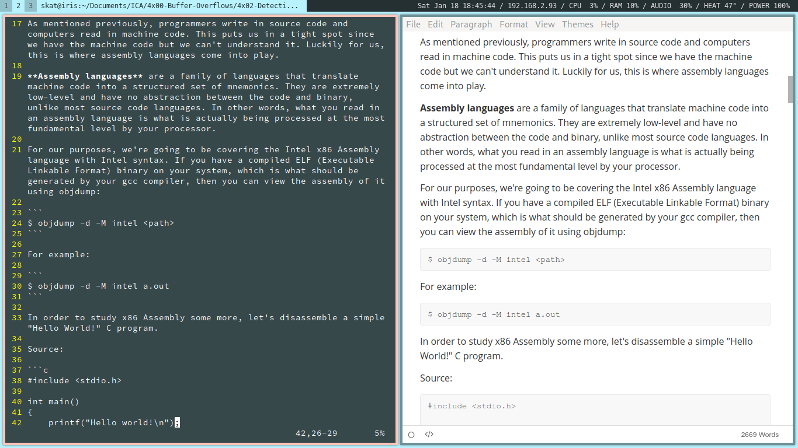
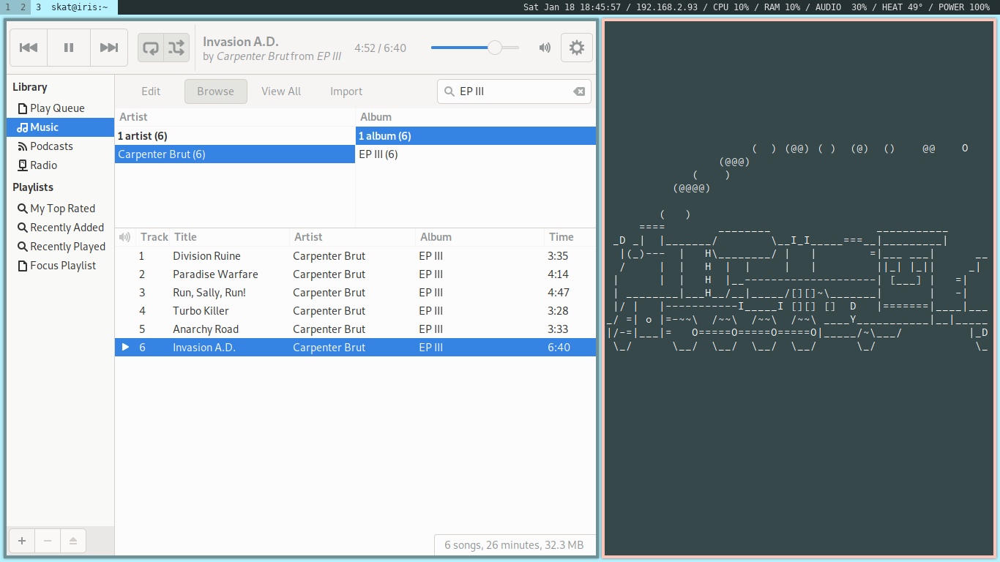
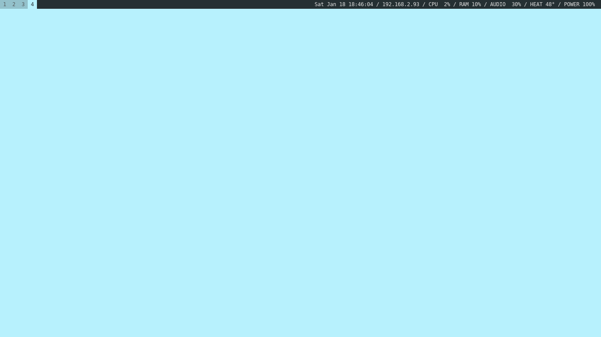

# dotfiles

My Arch Linux + i3-gaps + LightDM rice setup.

## Screenshots

## Setup

- OS: Arch Linux
- WM: i3-gaps
- DM: LightDM
- Greeter: Aether
- Lock: i3lock
- Shell: Bash
- Compositor: Compton

## Files

- lightdm.conf -> /etc/lightdm/lightdm.conf
- lightdm-webkit2-greeter.conf -> /etc/lightdm/lightdm-webkit2-greeter.conf
- .Xdefaults -> ~/.Xdefaults
- .bashrc -> ~/.bashrc
- i3config -> ~/.config/i3/config
- i3lock.sh -> ~/.config/i3/lock.sh
- .vimrc -> ~/.vimrc
- polyconfig -> ~/.config/polybar/config
- img/wallpapers/solid-blue.jpg -> ~/Pictures/Wallpapers/solid-blue.jpg
- img/wallpapers/solid-blue.jpg -> /usr/share/pixmaps/greeter.jpg
- img/graphics/lock.png -> /usr/share/pixmaps/lock.png

## Compton Tweak

Add `"name = 'Polybar tray window'"` to the shadow-exclude list and add `no-dock-shadow = true;` to the end of your Compton config file (~/.config/compton/config).
